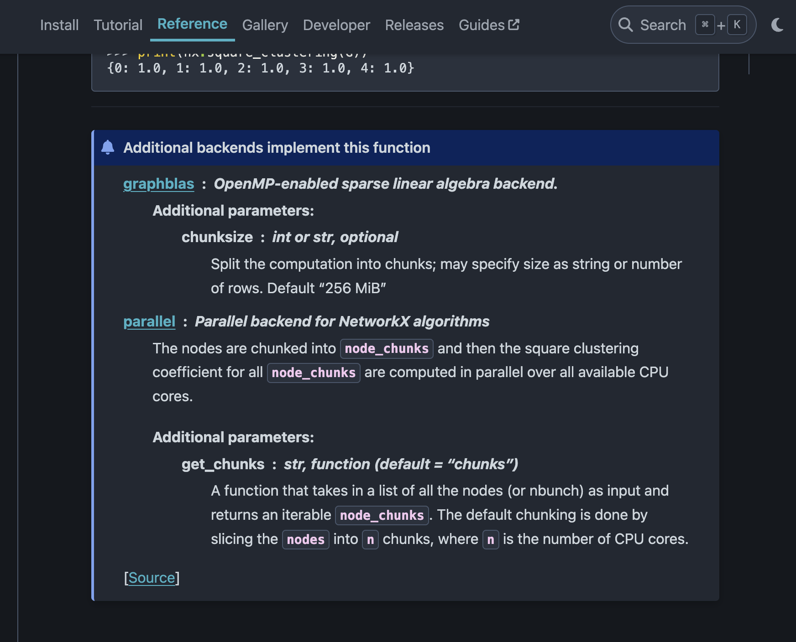

# Welcome to nx-parallel!

Hi, Thanks for stopping by!

This project is part of the larger NetworkX project. If you're interested in contributing to nx-parallel, you can first go through the [NetworkX's contributing guide](https://github.com/networkx/networkx/blob/main/CONTRIBUTING.rst) for general guidelines on contributing, setting up the development environment, and adding tests/docs, etc.

## Development workflow

To set the local development environment:

- Fork this repository.
- Clone the forked repository locally:

```.sh
git clone git@github.com:<your_username>/nx-parallel.git
```

- Create a fresh conda/mamba virtualenv ([learn more](https://github.com/networkx/networkx/blob/main/CONTRIBUTING.rst#development-workflow))

```.sh
# Creating a virtual environment
python -m venv nxp-dev

# Activating the venv
source nxp-dev/bin/activate
```

- Install the dependencies using the following command

```.sh
make install
```

- Create a new branch for your changes using

```.sh
git checkout -b <branch_name>
```

- Make the changes in this new feature branch and run tests before pushing them ([learn more](https://networkx.org/documentation/latest/reference/backends.html#testing-the-custom-backend)):

```.sh
make test
```

- If all the tests run successfully, stage your changes, then commit and push and then create a PR

```.sh
git add .
git commit -m"Your commit message"
git push origin <branch_name>
```

## Documentation syntax

For displaying a small note about nx-parallel's implementation at the end of the main NetworkX documentation, we use the `backend_info` [entry_point](https://packaging.python.org/en/latest/specifications/entry-points/#entry-points) (in the `pyproject.toml` file). The [`get_info` function](./_nx_parallel/__init__.py) is used to parse the docstrings of all the algorithms in nx-parallel and display the nx-parallel specific documentation on the NetworkX's main docs, in the "Additional Backend implementations" box, as shown in the screenshot below.



nx-parallel follows [sphinx docstring guidelines](https://the-ultimate-sphinx-tutorial.readthedocs.io/en/latest/_guide/_styleguides/docstrings-guidelines.html) for writing docstrings. But, while extracting the docstring to display on the main networkx docs, only the first paragraph of the function's description and the first paragraph of each parameter's description is extracted and displayed. So, make sure to include all the necessary information in the first paragraphs itself. And you only need to include the additional **backend** parameters in the `Parameters` section and not all the parameters. Also, it is recommended to include a link to the networkx function's documentation page in the docstring, at the end of the function description.

Here is an example of how the docstrings should be formatted in nx-parallel:

```.py
def parallel_func(G, nx_arg, additional_backend_arg_1, additional_backend_arg_2=None):
    """The parallel computation is implemented by dividing the
    nodes into chunks and ..... [ONLY THIS PARAGRAPH WILL BE DISPLAYED ON THE MAIN NETWORKX DOCS]

    Some more additional information about the function.

    networkx.func : <link to the function's networkx docs page>

    Parameters
    ----------
    additional_backend_arg_1 : int or float
        [YOU CAN HAVE MULTIPLE PARAGRAPHS BUT ONLY THE FIRST PARAGRAPH WILL BE DISPLAYED ON THE MAIN NETWORKX DOCS]

    additional_backend_arg_2 : None or str (default=None)
        ....
    """
```

## Chunking

In parallel computing, "chunking" refers to dividing a large task into smaller, more manageable chunks that can be processed simultaneously by multiple computing units, such as CPU cores or distributed computing nodes. It's like breaking down a big task into smaller pieces so that multiple workers can work on different pieces at the same time, and in the case of nx-parallel, this usually speeds up the overall process.

The default chunking in nx-parallel is done by slicing the list of nodes (or edges or any other iterator) into `n_jobs` number of chunks. (ref. [chunk.py](./nx_parallel/utils/chunk.py)). By default, `n_jobs` is `None`. To learn about how you can modify the value of `n_jobs` and other config options refer [`Config.md`](./Config.md). The default chunking can be overridden by the user by passing a custom `get_chunks` function to the algorithm as a kwarg. While adding a new algorithm, you can change this default chunking, if necessary (ref. [PR](https://github.com/networkx/nx-parallel/pull/33)).

## General guidelines on adding a new algorithm

- To get started with adding a new algorithm, you can refer to the existing implementations in nx-parallel and also refer to the [joblib's documentation on embarrassingly parallel `for` loops](https://joblib.readthedocs.io/en/latest/parallel.html).
- The algorithm that you are considering to add to nx-parallel should be in the main networkx repository and it should have the `_dispatchable` decorator. If not, you can consider adding a sequential implementation in networkx first.
- check-list for adding a new function:
  - [ ] Add the parallel implementation(make sure API doesn't break), the file structure should be the same as that in networkx.
  - [ ] Include the `get_chunks` additional parameter. Currently, all algorithms in nx-parallel offer the user to pass their own custom chunks. Unless it is impossible to chunk, please do include this additional parameter.
  - [ ] add the function to the `ALGORITHMS` list in [interface.py](./nx_parallel/interface.py). Take care of the `name` parameter in `_dispatchable` for the algorithms with same name but different implementations. The `name` parameter is used distinguish such algorithms in a single namespace. (ref. [docs](https://networkx.org/documentation/latest/reference/backends.html))
  - [ ] update the `__init__.py` files accordingly
  - [ ] docstring following the above format
  - [ ] add additional test, if needed. The smoke tests for the additional parameter `get_chunks` are done [here](https://github.com/networkx/nx-parallel/blob/main/nx_parallel/tests/test_get_chunks.py) together for all the algorithms.
  - [ ] run the [timing script](./timing/timing_individual_function.py) to get the performance heatmap (ref. [Issue#51](https://github.com/networkx/nx-parallel/issues/51))
  - [ ] add benchmark(s) for the new function(ref. the README in `benchmarks` folder for more details)

Happy contributing! 🎉
