# Timing Comparisons

Compares the performance of nx-parallel and NetworkX algorithms with the help of heatmaps.

The `timing/` folder has two subfolders, each with a `timing_individual_function.py` and its corresponding heatmaps:  

- `new_heatmaps/` → new timing script + heatmaps  
- `old_heatmaps/` → old timing script + heatmaps

## Machine Specifications

### Machine used for new heatmaps

Model: 14-inch MacBook Pro (2024)

CPU: Apple M4

RAM: 16 GB unified Memory

### Machine used for old heatmaps

Model: 13-inch MacBook Pro (2020)

CPU: 2 GHz Quad-Core Intel Core i5

RAM: 16 GB LPDDR4X at 3733 MHz

## Heatmaps

### New Heatmaps (`new_heatmaps/`)

betweeness_centrality
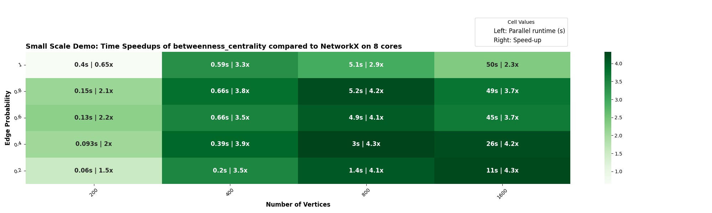

edge_betweeness_centrality
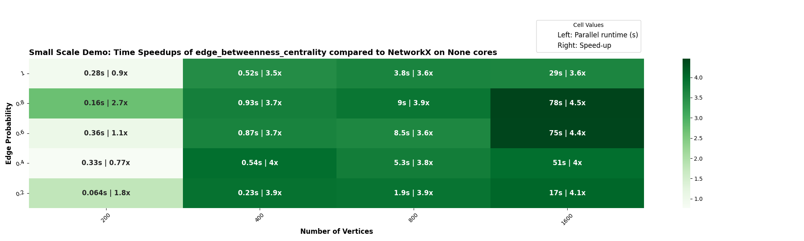

number_of_isolates
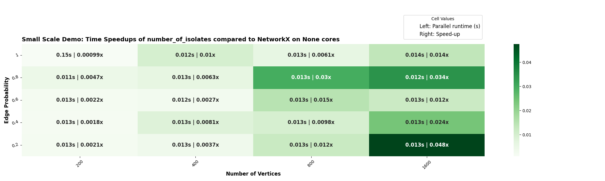

tournament.is_reachable
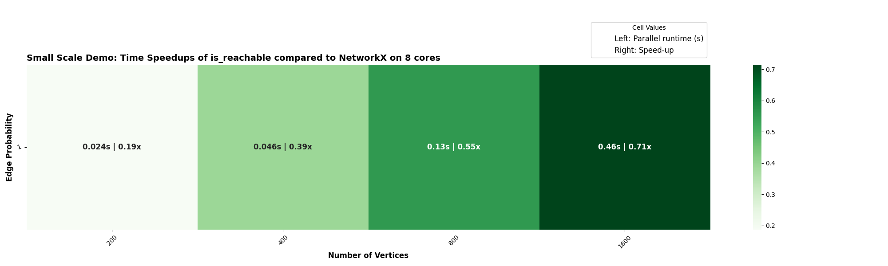

node_redundancy
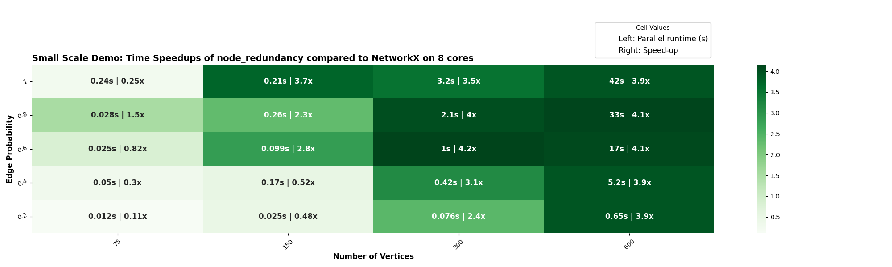

## Old heatmaps (`old_heatmaps/`):

all_pairs_all_shortest_paths

all_pairs_bellman_ford_path

all_pairs_bellman_ford_path_length
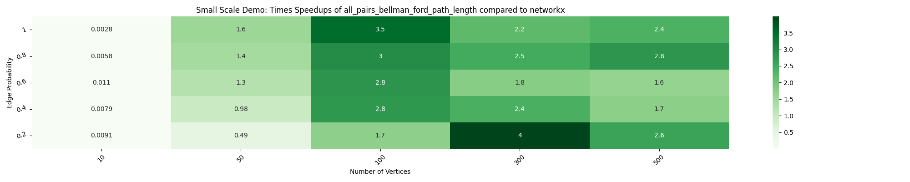

all_pairs_dijkstra_path
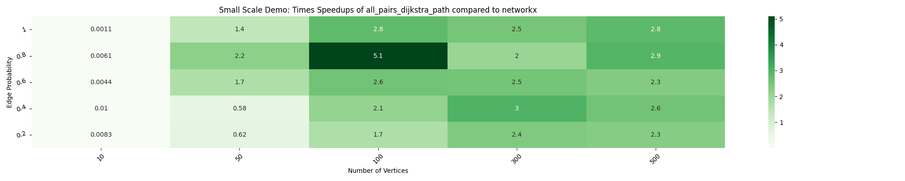

all_pairs_dijkstra_path_length
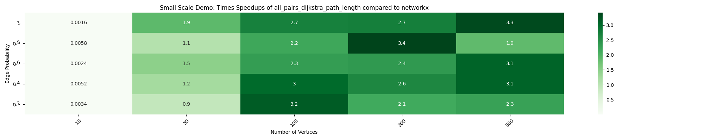

all_pairs_node_connectivity

all_pairs_shortest_path
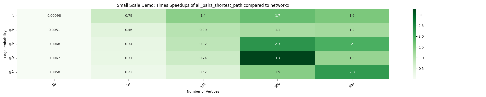

all_pairs_shortest_path_length
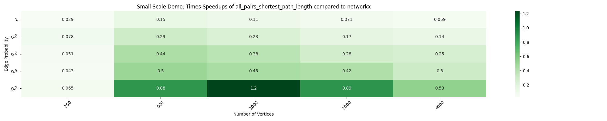

closeness_vitality

is_strongly_connected
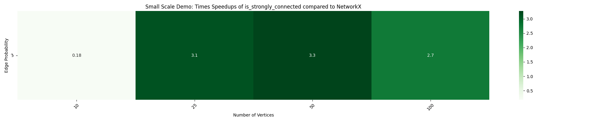

johnson
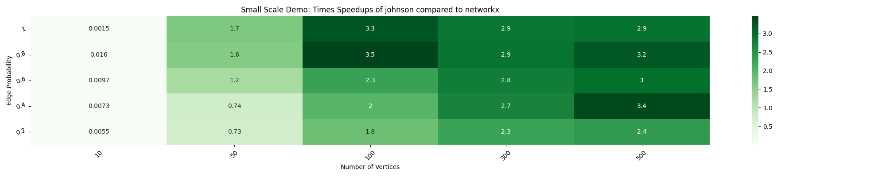

local_efficiency

square_clustering

