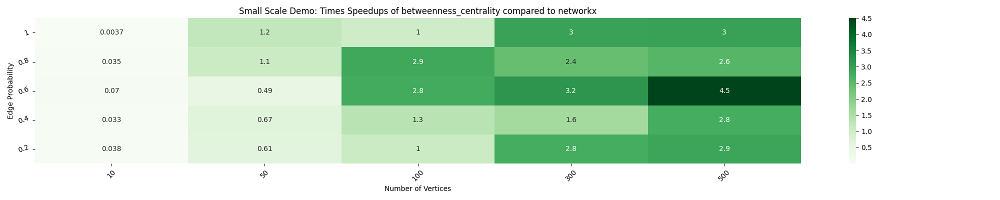
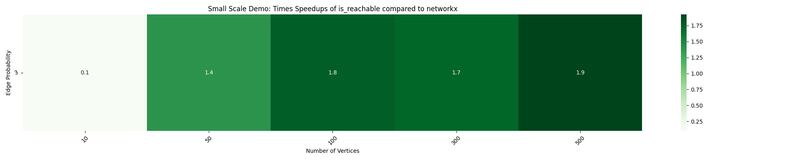

# Timing Comparisons

---

Model: 13-inch MacBook Pro (2020)

CPU: 2 GHz Quad-Core Intel Core i5

RAM: 16 GB LPDDR4X at 3733 MHz

Code to generate heatmaps in timing_individual_function.py and timing_all_functions.py.

## All parallelized functions at this time:

## Individual functions:

betweenness_centrality

closeness_vitality

local_efficiency

tournament is_reachable

all_pairs_bellman_ford_path

